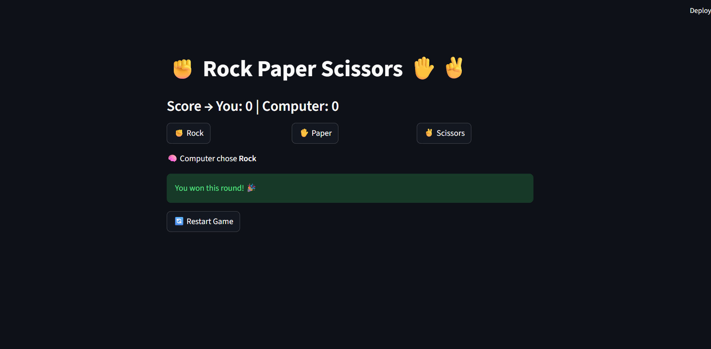

# ✊ ✋ ✌️ Rock Paper Scissors

A classic **Rock Paper Scissors** game built with **Python** and **Streamlit**. Play against the computer, and the first one to reach **5 points** wins the match!



---

## ✨ Features

- Play against the computer, which picks randomly each round
- Simple one-click buttons: ✊ Rock, ✋ Paper, ✌️ Scissors
- Shows what the computer chose after every round
- Live scoreboard for **You** and **Computer**
- Round results: win 🎉, lose 💻 or tie 🤝
- First to **5 points** wins the game
- **Restart Game** button to reset the scores and play again
- Scores are kept between clicks using Streamlit's `session_state`

## 🕹️ How to Play

1. Click **Rock**, **Paper** or **Scissors**.
2. The computer picks its move at random, and the round result is shown.
3. The winner of each round gets 1 point (a tie gives no points).
4. The first player to reach **5 points** wins the game.
5. Click **🔄 Restart Game** to start over.

### Game Rules

| Your Choice | Beats |
|-------------|-------|
| ✊ Rock | ✌️ Scissors |
| ✋ Paper | ✊ Rock |
| ✌️ Scissors | ✋ Paper |

## 🛠️ Tech Stack

| Technology | Purpose |
|------------|---------|
| Python 3 | Game logic |
| Streamlit | Web interface |
| `random` module | Computer's random choice |

## 📁 Project Structure

```
├── streamlituii1.py      # Game code
├── requirements.txt      # Dependencies
├── game_screenshot.png   # Screenshot
└── README.md
```

## 🚀 Getting Started

### 1. Install Streamlit

```bash
pip install -r requirements.txt
```

### 2. Run the game

```bash
streamlit run streamlituii1.py
```

The game opens in your browser at `http://localhost:8501`.

## 🧱 How It Works

- Scores and the `game_over` flag are stored in `st.session_state`, so they are not lost when the page reruns after each click.
- Rock, Paper and Scissors are mapped to the numbers 1, 2 and 3, and the computer picks one with `random.randint(1, 3)`.
- The winner is decided by comparing the two choices, and the matching score is increased.
- When either score reaches 5, the final result is shown and the choice buttons are hidden.

## 🔮 Future Improvements

- Add a "best of N" option so players can choose the winning score
- Show a history of previous rounds
- Add sound or animation effects
- Add difficulty levels or a smarter computer opponent
- Deploy online with Streamlit Community Cloud

## 👨‍💻 Author

Made by **<Kamran Shahid>**
GitHub: [@kamran-077)

---

⭐ If you enjoyed the game, give this project a star!
